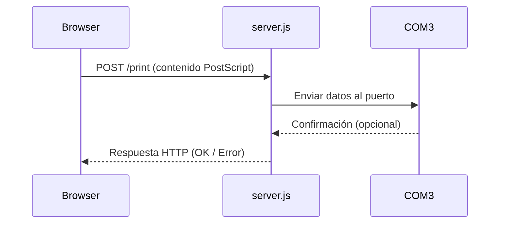
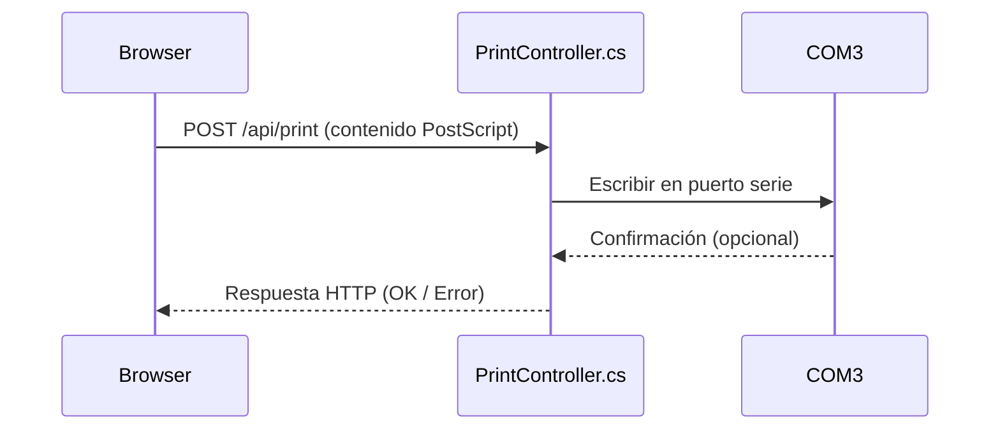

# Print Service (PostScript over COM)

Este proyecto permite exponer una API local para enviar datos en formato PostScript a una impresora conectada al puerto COM (como COM3 o COM4), desde una aplicación web (por ejemplo, Angular).

Incluye dos implementaciones:
- **Node.js** (`print-service-node`)
- **.NET 6 (WebAPI)** (`print-service-dotnet`)

También incluye:
- **Emulador de impresora en Python** (`postscript_com3_emulator_by_job.py`) para pruebas sin hardware real
- Scripts para instalación del servicio como servicio de Windows usando NSSM
- Script Inno Setup para generar instalador `.exe`

---

## 📦 Estructura del Proyecto

```
print-service-node/       --> Servicio local Node.js
print-service-dotnet/     --> Servicio local .NET 6 WebAPI
postscript_com4_emulator_by_job.py  --> Emulador de impresora en COM4
```

---

## ⚙️ Requisitos

### Para Node.js
- Node.js
- `pkg` (`npm install -g pkg`)
- NSSM instalado en: `C:\Program Files\nssm\nssm.exe`

### Para .NET
- .NET 6 SDK
- NSSM
- (Opcional) Inno Setup para crear instalador `.exe`

---

## 🚀 Instalación

### Node.js

```bash
cd print-service-node
npm install
pkg .
```

Para instalar como servicio:

```bash
install_service.bat
```

---

### .NET

```bash
cd print-service-dotnet
dotnet build
```

Luego:

```bash
install_service.bat
```

---

## 🖨️ Emulador de Impresora (Python)

Archivo: `postscript_com4_emulator_by_job.py`

Este script simula una impresora escuchando en el puerto COM4. Cada vez que recibe una impresión (detecta salto de línea o `\x0C`), guarda el contenido recibido en un archivo `.txt` dentro de la carpeta `impresiones`.

### Uso:

```bash
pip install pyserial
python postscript_com4_emulator_by_job.py
```

---

## 🧪 Diagramas de Secuencia

### Node.js (`print-service-node/server.js`)



### .NET (`print-service-dotnet/Controllers/PrintController.cs`)



---

## 📦 Crear Instalador `.exe` con Inno Setup (.NET)

1. Instalar [Inno Setup](https://jrsoftware.org/isinfo.php)
2. Abrir `PrintServiceInstaller.iss` en Inno
3. Compilar

---

## 🧹 Desinstalación

Ambas versiones tienen su propio `uninstall_service.bat` para detener y eliminar el servicio.

---

## 📝 Licencia

MIT