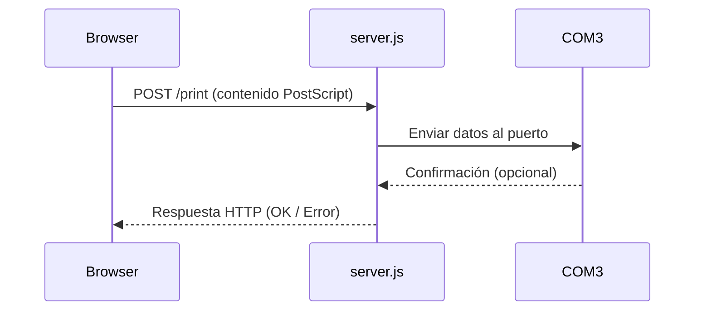
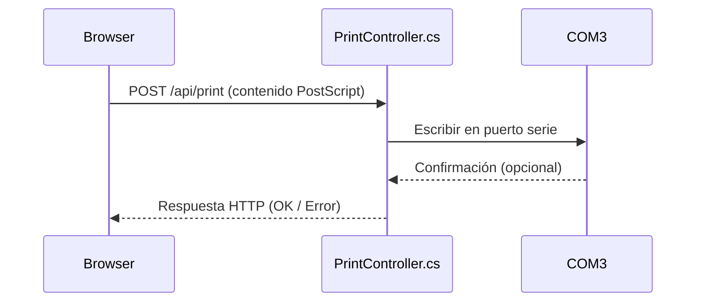

# Print Service (PostScript over COM)

Este proyecto permite exponer una API local para enviar datos en formato PostScript a una impresora conectada al puerto COM (como COM3), desde una aplicación web (por ejemplo, Angular).

Incluye dos implementaciones:
- **Node.js** (`print-service-node`)
- **.NET 6 (WebAPI)** (`print-service-dotnet`)

También incluye:
- **Emulador de impresora en Python** (`emulator/postscript_com3_emulator.py`) para pruebas sin hardware real
- Scripts para instalación del servicio como servicio de Windows usando NSSM
- Script Inno Setup para generar instalador `.exe`

---

## 📦 Estructura del Proyecto

```
print-service-node/                 --> Servicio local Node.js
print-service-dotnet/              --> Servicio local .NET 6 WebAPI
emulator/postscript_com3_emulator.py  --> Emulador de impresora en COM3
```

---

## ⚙️ Requisitos

### Para Node.js
- Node.js
- `pkg` (`npm install -g pkg`)
- NSSM instalado en: `C:\Program Files\nssm\nssm.exe`

### Para .NET
- .NET 6 SDK
- NSSM
- (Opcional) Inno Setup para crear instalador `.exe`

### Para pruebas sin impresora física
- [com0com (crear puertos COM virtuales)](https://sourceforge.net/projects/com0com/)
  - Instalar
  - Crear par: `COM3 <-> COM4`
  - Usar COM3 en el servicio y COM4 en el emulador, o viceversa

---

## 🚀 Instalación

### Node.js

```bash
cd print-service-node
npm install
pkg .
```

Para instalar como servicio:

```bash
install_service.bat
```

---

### .NET

```bash
cd print-service-dotnet
dotnet build
```

Luego:

```bash
install_service.bat
```

---

## 🖨️ Emulador de Impresora (Python)

Archivo: `emulator/postscript_com3_emulator.py`

Este script simula una impresora PostScript conectada a `COM3`. Cada vez que recibe un bloque de datos (detecta `\n` o `\x0C` como final), guarda el contenido en un archivo `.txt` dentro de una carpeta `impresiones`.

### ¿Cómo funciona?
- Abre el puerto `COM3`
- Escucha continuamente por datos entrantes
- Cuando detecta fin de trabajo, guarda el contenido recibido como:
  ```
  impresiones/impresion_YYYYMMDD_HHMMSS.txt
  ```

### Uso:

```bash
pip install pyserial
python emulator/postscript_com3_emulator.py
```

---

## 🧪 Diagramas de Secuencia

### Node.js (`print-service-node/server.js`)



### .NET (`print-service-dotnet/Controllers/PrintController.cs`)



---

## 📦 Crear Instalador `.exe` con Inno Setup (.NET)

1. Instalar [Inno Setup](https://jrsoftware.org/isinfo.php)
2. Abrir `PrintServiceInstaller.iss` en Inno
3. Compilar

---

## 🧹 Desinstalación

Ambas versiones tienen su propio `uninstall_service.bat` para detener y eliminar el servicio.

---

## 📝 Licencia

MIT